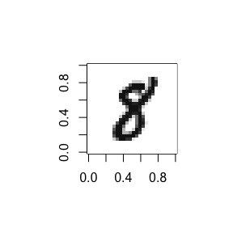

MNIST Image Data
----------------

Chris Hua / `chua@wharton.upenn.edu`

Installation
------------

``` r
install.packages("devtools")
devtools::install_github("stillmatic/MNIST")
```

Usage
-----

Data is exported as `MNIST::mnist_train` and `MNIST::mnist_test`.

``` r
MNIST::mnist_train %>% dim
```

    ## [1] 60000   785

``` r
table(MNIST::mnist_test$y)
```

    ## 
    ##    0    1    2    3    4    5    6    7    8    9 
    ##  980 1135 1032 1010  982  892  958 1028  974 1009

``` r
MNIST::show_digit(MNIST::mnist_train[42,])
```



Notes
-----

Credit belongs to [Yann Lecun](http://yann.lecun.com/exdb/mnist/), etc.
